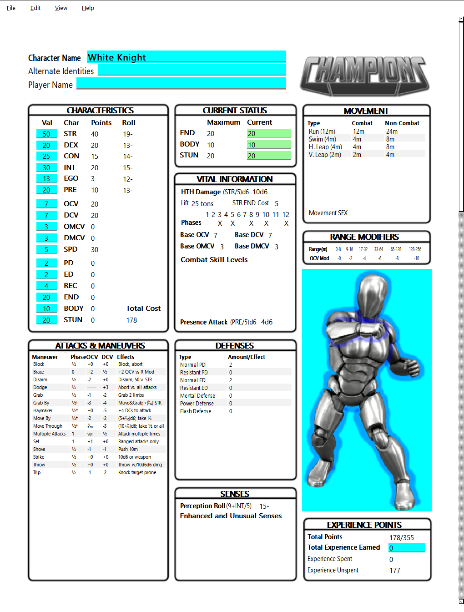
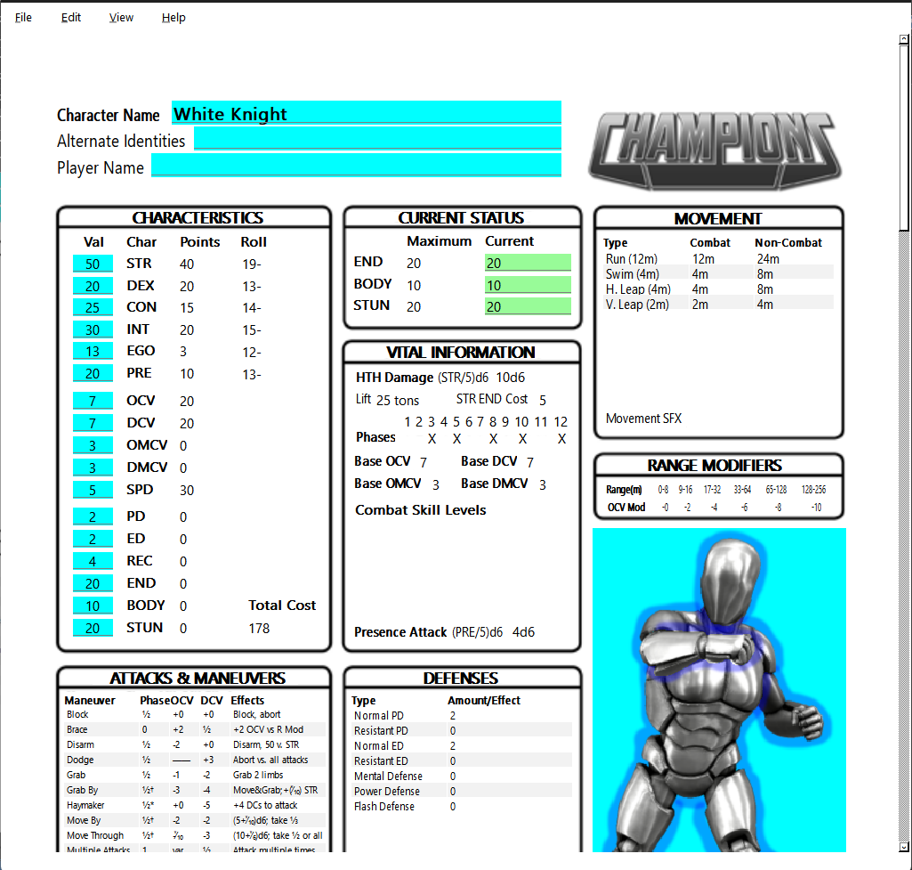
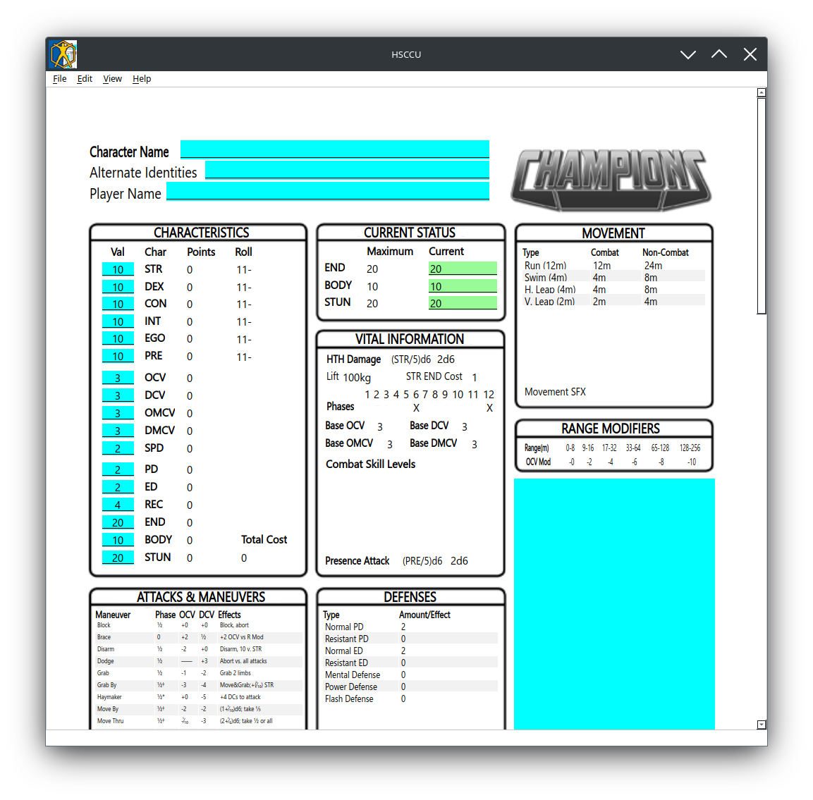
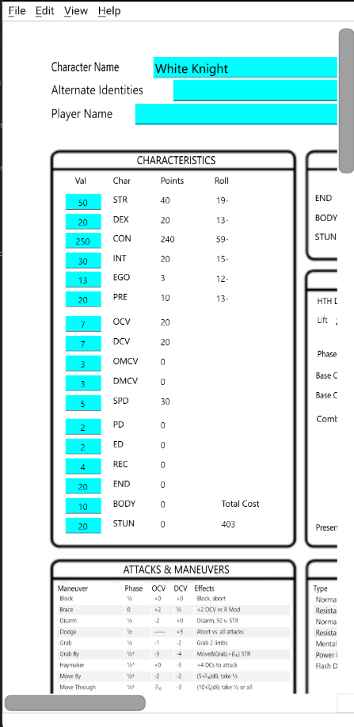
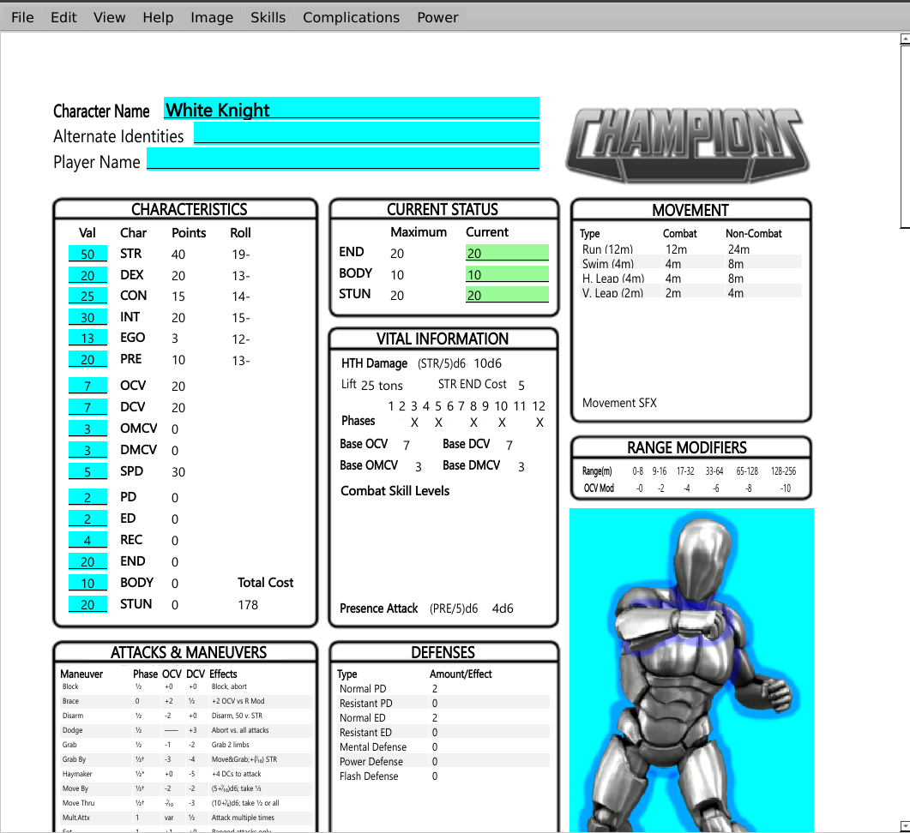

# HSCCU — HERO System Character Creator, Unlicensed

HSCCU is a cross-platform character creator for the **HERO System**. It is available for Windows, Linux, Android, and the web through WebAssembly (WASM).

> **Important:** HSCCU is an independent, unofficial, unlicensed project. It is not affiliated with, sponsored by, approved by, or endorsed by Hero Games or any other owner of HERO System intellectual property.

<!--
Screenshot files referenced below are expected in docs/images/.
Recommended filenames:
  hsccu-main.png
  hsccu-windows.png
  hsccu-linux.png
  hsccu-android.png
  hsccu-wasm.png
-->



**Runs on Windows, Linux, Android, and in the browser via WebAssembly.**

| Windows | Linux | Android | WebAssembly |
| --- | --- | --- | --- |
|  |  |  |  |

## Quick Links

- **Source code:** https://github.com/ldraconus/HSCCU
- **Releases:** https://github.com/ldraconus/HSCCU/releases
- **Run HSCCU online:** https://hsccu.chris-m-olson.workers.dev/HSCCU

The Releases page is the intended home for packaged Windows, Linux, Android, and WASM builds.

## Downloads

| Platform | Release file | Installation |
| --- | --- | --- |
| Windows | `HSCCUInstaller.exe` | Run the installer and follow the prompts. |
| Linux | `HSCCUInstaller.run` | Run the installer from your file manager or from a terminal. |
| Android | `android-build-HSCCU-release-signed.apk` | Sideload the signed APK. |
| WebAssembly | `HSCCU.tar.gz` | Extract the archive for a local/self-hosted web copy, or use the online version. |

The Windows and Linux installers are built with the **Qt Installer Framework**.

## Installation

### Windows

1. Download `HSCCUInstaller.exe` from the [GitHub Releases](https://github.com/ldraconus/HSCCU/releases) page.
2. Run `HSCCUInstaller.exe`.
3. Follow the installer prompts.
4. Launch HSCCU after installation.

### Linux

HSCCU has been tested on **Zorin OS, Linux Mint, and Cinnamon**.

1. Download `HSCCUInstaller.run` from the [GitHub Releases](https://github.com/ldraconus/HSCCU/releases) page.
2. Run it from your file manager.
3. Follow the installer prompts.

If your desktop does not treat the installer as executable, use a terminal:

```bash
chmod +x HSCCUInstaller.run
./HSCCUInstaller.run
```

Other Linux distributions may work, but have not necessarily been tested.

### Android

HSCCU is currently distributed as a signed APK rather than through the Google Play Store.

1. Download `android-build-HSCCU-release-signed.apk` from the [GitHub Releases](https://github.com/ldraconus/HSCCU/releases) page.
2. Get the APK onto your Android device. For example, you can:
   - download it directly on the device;
   - copy it over USB; or
   - transfer it using another file-sharing method.
3. Open the APK from a file manager or your browser's downloads list.
4. If Android asks for permission to install apps from that source, enable **Install unknown apps** for the file manager or browser you are using.
5. Return to the APK and choose **Install**.

The exact wording varies somewhat by Android version and device manufacturer.

For safety, install HSCCU APKs only from the official HSCCU GitHub Releases page.

### Web / WASM

The easiest way to use the WebAssembly build is simply to open:

**https://hsccu.chris-m-olson.workers.dev/HSCCU**

No installation is required for the hosted version.

For a local or self-hosted copy:

1. Download `HSCCU.tar.gz` from the [GitHub Releases](https://github.com/ldraconus/HSCCU/releases) page.
2. Extract it wherever you want the WASM build to live:

```bash
tar -xzf HSCCU.tar.gz
```

3. Use the extracted files from your preferred local or web-server location.

## Building from Source

### Requirements

HSCCU is a Qt 6 / C++23 application built with CMake.

The current CMake project requires:

- **CMake 3.19 or newer**
- **Qt 6.5 or newer** according to `CMakeLists.txt`
- a compiler/toolchain with **C++23** support
- Qt components used by the project, including Core, Gui, Widgets, PrintSupport, and Network

Qt versions **6.10.3 through 6.12.0** have been tested directly.

Earlier Qt 6 releases may work, but the farther back you go, the less tested they are. **Qt 5.x and earlier are not supported and should not be expected to build or run correctly.**

### Qt Creator

1. Clone or download the repository:

```bash
git clone https://github.com/ldraconus/HSCCU.git
```

2. Start Qt Creator.
3. Open the repository's `CMakeLists.txt` as the project.
4. Select a working Qt 6 kit for the platform you want to build.
5. Configure the project.
6. Build and run.

For Android or WASM builds, the corresponding Qt Android or WebAssembly kit and its required platform toolchain must already be configured in Qt Creator.

### Command Line

You need a working Qt 6 toolchain that CMake can find.

From the repository root:

```bash
cmake -S . -B build -DCMAKE_BUILD_TYPE=Release
cmake --build build --config Release
```

If CMake cannot find Qt automatically, point it at the appropriate Qt installation for your compiler/platform, for example:

```bash
cmake -S . -B build \
    -DCMAKE_BUILD_TYPE=Release \
    -DCMAKE_PREFIX_PATH=/path/to/Qt/6.x.x/your-kit
```

The exact Qt path and toolchain depend on your operating system, compiler, and target platform.

## Reporting Problems

If you find a bug, please report it through the repository's issue tracker:

https://github.com/ldraconus/HSCCU/issues

When useful, include:

- operating system and version;
- Qt version, if you built HSCCU yourself;
- whether you are using Windows, Linux, Android, or WASM;
- steps needed to reproduce the problem; and
- any relevant error messages or logs.

## License and Intellectual Property

### HSCCU code and original assets

Copyright © 2026 Christopher Martin Olson. All rights reserved.

Permission is granted to download and use official HSCCU binary releases for personal, non-commercial use.

Unless another license is explicitly provided for a particular file or component, no permission is granted to copy, modify, redistribute, publish, sublicense, sell, or create derivative works from HSCCU source code or original HSCCU assets without prior written permission from the copyright holder.

This restriction applies only to material owned by the HSCCU copyright holder. It does not limit any rights granted by the licenses of Qt or other third-party software and materials used by or distributed with HSCCU.

### HERO System / Hero Games disclaimer

HSCCU (**HERO System Character Creator, Unlicensed**) is an independent, unofficial project. It is **not affiliated with, sponsored by, approved by, or endorsed by DOJ, Inc. d/b/a Hero Games**, or by any other owner of intellectual property referenced by the application.

**HERO System** is identified by Hero Games publications as a trademark of DOJ, Inc. d/b/a Hero Games. HERO System rules, game content, trademarks, product names, logos, artwork, and other third-party intellectual property remain the property of their respective owners.

No ownership of HERO System, Hero Games, or any other third-party intellectual property is claimed by HSCCU. References to third-party names and marks are for identification and compatibility purposes only. No license to any third-party intellectual property is granted by this repository or by distribution of HSCCU.

Qt and all other third-party libraries or components remain subject to their respective licenses.

---

HSCCU is developed independently for people who want to create and manage HERO System characters across desktop, mobile, and web platforms.
